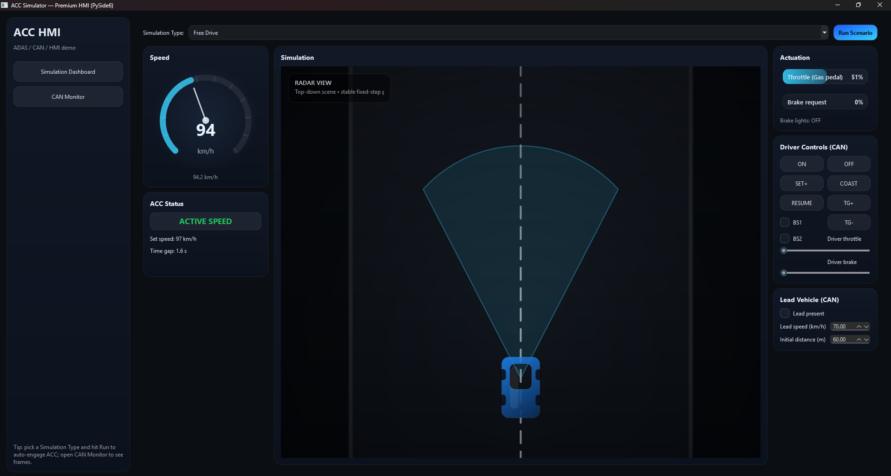
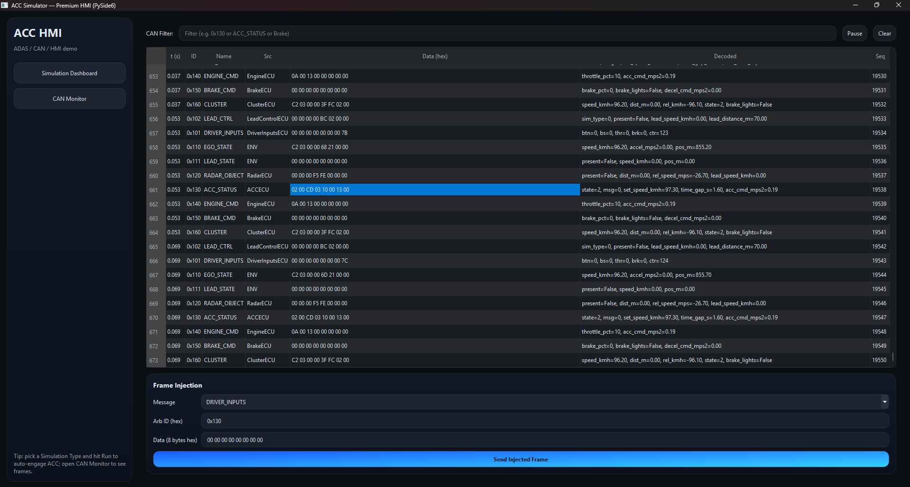

# Adaptive Cruise Control (ACC) Simulator — Virtual CAN + PySide6 (Qt)

A **desktop simulator** for **Adaptive Cruise Control (ACC)** built with **Python + PySide6 (Qt)**.

This project models a simplified in-vehicle network using an **in-memory Virtual CAN bus**, splits the system into multiple **ECUs**, and provides a GUI with:
- **Dashboard** (speed / set speed / time gap / status / driver controls)
- **CAN Monitor** (live frames table + decoded signals)
- **Scenario Explorer** (lead vehicle scenarios: stop&go, cut-in, hard brake, traffic jam, ...)

> Goal: **learn and prototype ACC logic** (state machine + longitudinal control) while observing how signals move through a CAN network.

---

## Screenshots

Dashboard + scenario view:



CAN monitor view:



---

## Key features

- **Virtual CAN architecture**
  - Consistent **8-byte payloads**
  - Arbitration IDs
  - Timestamp + sequence counter
  - Live monitor table

- **Multi-ECU design** (communication only via CAN frames)
  - Driver Inputs ECU
  - Lead/Scenario ECU
  - Radar ECU (relative distance & relative speed)
  - ACC ECU (state machine + accel command)
  - Engine ECU (throttle command)
  - Brake ECU (brake command + brake lights)
  - Cluster ECU (dashboard/HMI)

- **ACC behavior implemented**
  - Activation only if **ego speed >= 40 km/h** and **no brake switch pressed**
  - Cancellation on OFF command, brake press, or low speed
  - Automatic mode switching:
    - **Speed control** (no lead vehicle)
    - **Time-gap control** (lead vehicle detected)
  - Deceleration authority limit: **0.2 g**
    - If required decel exceeds limit -> **Driver intervention required**
  - Fixed-step simulation loop: **50 Hz** (`dt = 0.02 s`)

---

## Repository content

```
ACC_Project/
├─ ACC_App.py                              # Main / simulator entry
├─ ACC_Test_Pics/                          # Screenshots for demo/report
│  ├─ Test1.png
│  ├─ Test1_CAN_Monitor.png
│  ├─ Test2.png
│  ├─ Test2_CAN_Monitor.png
└─  MOKHTARI_Anass_Rapport_de_projet.pdf   # Project report (documentation)
```

**Recommended entry point:** `ACC_PERFECT.py`

---

## Requirements

- Python **3.9+** (3.10+ recommended)
- **PySide6**

Install dependency:

```bash
pip install PySide6
```

> The simulator relies on Python standard library + PySide6 only.

---

## Quick start

From the project folder:

```bash
python ACC_App.py
```

### Typical usage flow (GUI)

1. Open **Dashboard**
2. Click **ON**
3. Press **SET+** to capture current ego speed as set speed (requires **>= 40 km/h**)
4. Use **TG+ / TG-** to adjust the time gap
5. Open **Scenario Explorer** and enable a scenario (lead vehicle behavior)
6. Watch:
   - ACC state (OFF / STANDBY / ACTIVE / INTERVENTION)
   - throttle / brake commands
   - CAN frames in **CAN Monitor**

---

## Architecture

### Virtual CAN bus (in-memory)

The simulator uses a lightweight CAN bus model:
- ECUs publish frames: `bus.send(arb_id, data, src="ECUName")`
- ECUs read frames: `bus.last(arb_id)`
- The monitor records frames with:
  - `seq`, `timestamp`, `arb_id`, `data[8]`, `src`, decoded signals

This makes it easy to:
- visualize network traffic
- debug timing and state transitions
- prototype new signals without hardware

### ECUs and responsibilities

| ECU | Role | Inputs | Outputs |
|---|---|---|---|
| DriverInputsECU | Buttons, brake switches, pedal requests | GUI controls | `ID_DRIVER_INPUTS` |
| LeadControlECU | Scenario selection + lead config | Scenario Explorer | `ID_LEAD_CTRL` |
| Plant / Environment | Ego & lead longitudinal motion (simple physics) | engine/brake + scenario | `ID_EGO_STATE`, `ID_LEAD_STATE` |
| RadarECU | Relative distance/speed computation | ego + lead states | `ID_RADAR_OBJECT` |
| ACCECU | State machine + accel request | driver + radar + ego | `ID_ACC_STATUS` |
| EngineECU | Accel -> throttle command | ACC status | `ID_ENGINE_CMD` |
| BrakeECU | Decel -> brake command | ACC status | `ID_BRAKE_CMD` |
| ClusterECU | HMI/dashboard signals | ACC + ego state | `ID_CLUSTER` |

---

## CAN messages (IDs)

All frames use **8 bytes**. IDs are defined in `ACC_PERFECT.py`:

| Message | ID (hex) | Description |
|---|---:|---|
| `ID_DRIVER_INPUTS` | `0x101` | Buttons, brake switches, driver pedals |
| `ID_LEAD_CTRL` | `0x102` | Scenario type + lead target speed/distance |
| `ID_EGO_STATE` | `0x110` | Ego speed/acc/position |
| `ID_LEAD_STATE` | `0x111` | Lead presence + speed/position |
| `ID_RADAR_OBJECT` | `0x120` | Lead detected + distance + relative speed |
| `ID_ACC_STATUS` | `0x130` | ACC state + set speed + time gap + accel request |
| `ID_ENGINE_CMD` | `0x140` | Throttle command |
| `ID_BRAKE_CMD` | `0x150` | Brake command (+ brake lights) |
| `ID_CLUSTER` | `0x160` | Cluster/HMI info |

### Driver buttons bitfield

| Button | Bit |
|---|---:|
| ON | `1<<0` |
| OFF | `1<<1` |
| SET+ | `1<<2` |
| COAST | `1<<3` |
| RESUME | `1<<4` |
| TG+ | `1<<5` |
| TG- | `1<<6` |

---

## ACC logic (summary)

### Activation / cancellation
- Activation allowed only if:
  - ego speed **>= 40 km/h**
  - brake switches **BS1=0** and **BS2=0**
- Cancellation occurs if:
  - OFF command
  - brake pressed (BS1/BS2 or brake pedal)
  - ego speed too low during active control

### Operating modes
- **Speed control**: no lead detected -> track `set_speed_kmh`
- **Time gap control**: lead detected -> regulate distance based on selected time gap

### Authority limit (safety)
- Deceleration request limited to **0.2 g**
- If controller needs more than this:
  - ACC enters **DRIVER_INTERVENTION_REQUIRED**
  - applies max allowed decel and requests driver intervention

---

## Customize / extend

### Add a new scenario
1. Create a new scenario behavior (lead presence, speed, position)
2. Register it in the scenario list in the Scenario Explorer

### Modify the controller
Edit the ACC ECU logic:
- speed-control gains
- time-gap gains
- thresholds (activation, cancellation, authority)

### Add a new CAN signal
1. Extend the encoding/decoding helpers in `CANCodec`
2. Add a new arbitration ID constant
3. Publish/consume it in the relevant ECUs
4. Display decoded fields in the CAN Monitor

---

## Troubleshooting

### `ModuleNotFoundError: No module named 'PySide6'`
```bash
pip install PySide6
```

### ACC does not activate
- Ensure ego speed is **>= 40 km/h**
- Ensure brake switches are not active
- Press **ON**, then **SET+**

---

## Credits

- Implemented by **Anass Mokhtari**: simulator, virtual CAN, GUI, scenarios, and ACC logic.
- Theory and details are included in `MOKHTARI_Anass_Rapport_de_projet.pdf`.

---

## License

No license is included by default.  
If you plan to publish this publicly and accept reuse, add a license (MIT is a common choice for academic software).
